*** Hospital Patient Archive Management Platform ***

The Hospital Patient Archive Management Platform is a comprehensive digital system designed to streamline the management of patient records and archives within a healthcare facility. This platform provides an efficient way to handle patient information, enhancing the workflow within medical institutions.

*** Getting Started ***
*** Prerequisites: ***
Visual Studio Code (VS Code)
WAMP Server
*** Installation: ***
Run the DDL script to create the database.
Execute the test script for each class to populate the database.
Open your localhost in a web browser and select the project to access the dashboard.

*** Usage  ***
*** Dashboard  ***
Upon opening the platform, you will be greeted with the login screen.

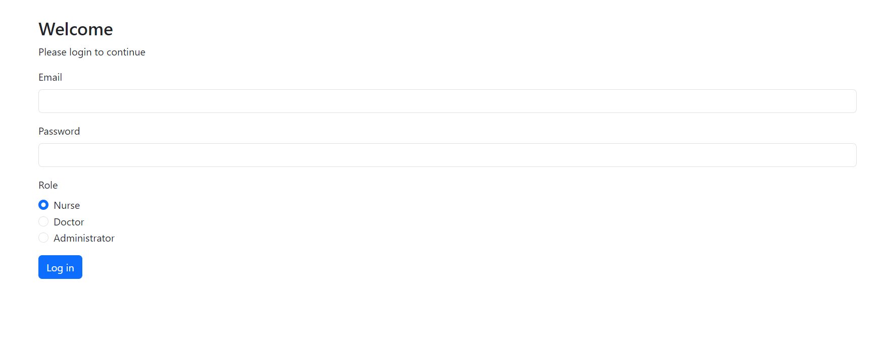

*** Doctor's Dashboard  ***
If you log in as a doctor, you will see the following dashboard.
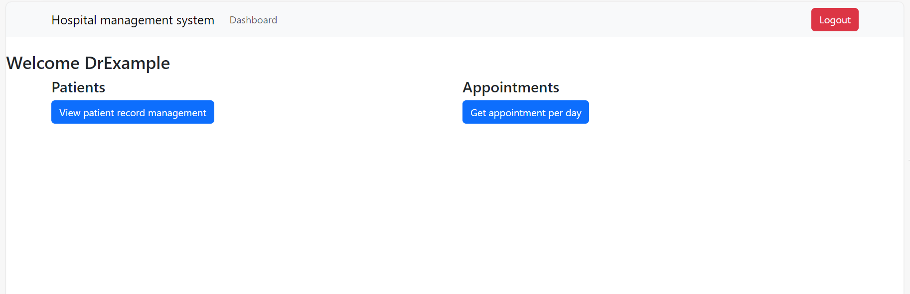

 *** View Patient Management Record  ***
To view patient management records:
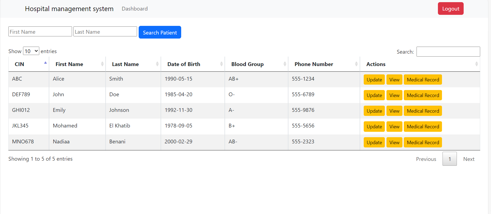

Here you can select the number of entries to display.

*** Search for a Patient ***
You can search for a patient using their first and last name.

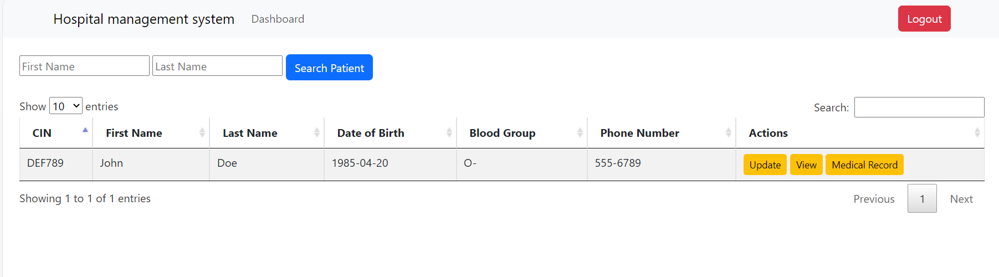

Alternatively, a simple name search is also available.

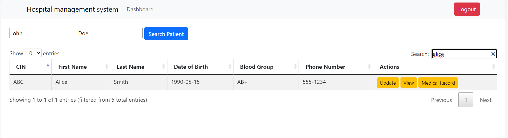

 *** Update a Patient's Information  ***
To update a patient's information, follow these steps:

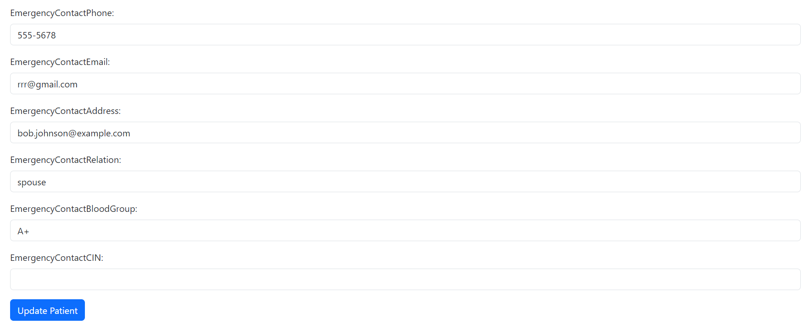
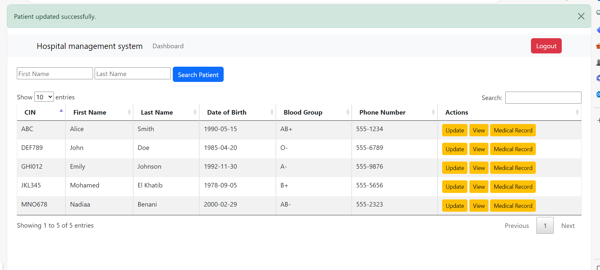

*** View Patient Information ***
You can also view detailed patient information.
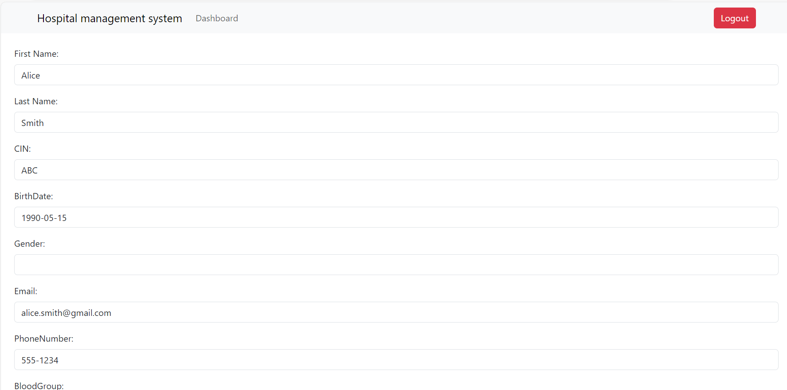

*** View Medical Record Detail ***
To view a patient's medical record details:
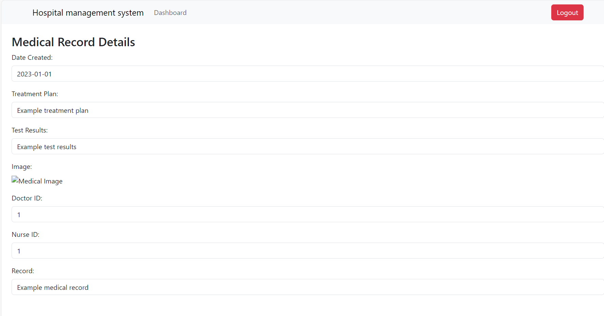

*** Appointments Per Day ***
Go back to the dashboard to view appointments scheduled for the day.
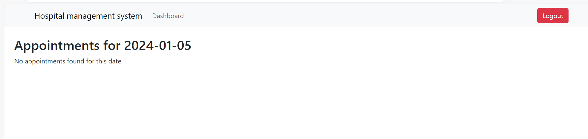
 *** Logout ***
You can log out of the system as needed.
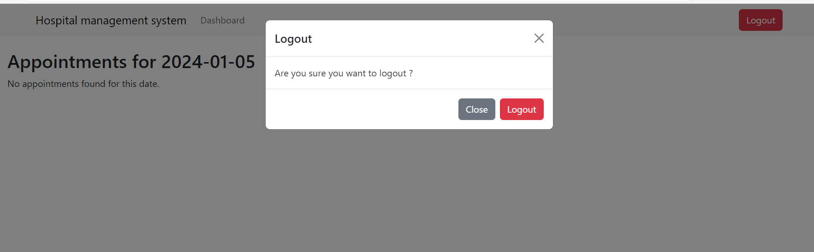

*** Nurse's Dashboard ***
If you log in as a nurse, you will see a similar dashboard.
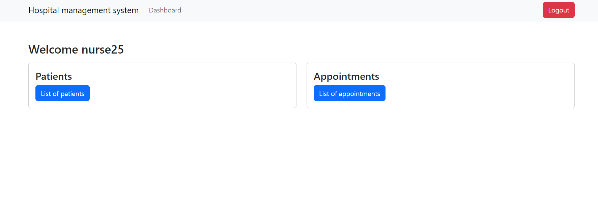

*** Patient List ***
Nurses can access the complete list of patients.
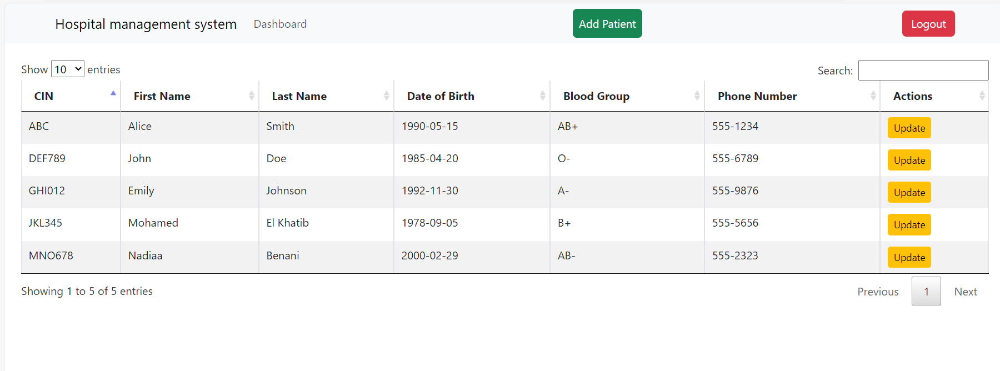

The search and update functionalities for nurses are similar to those in the doctor's dashboard.
*** Adding a New Patient ***
Nurses can add new patients to the system.

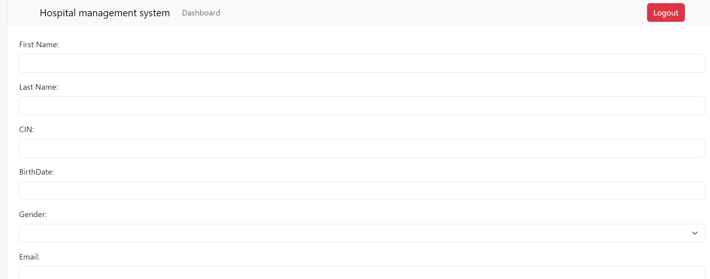

*** Nurse's Appointments ***
From the nurse's dashboard, you can view and manage appointments.
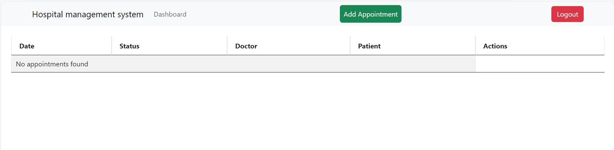
*** Adding a New Appointment ***
Nurses can schedule new appointments.
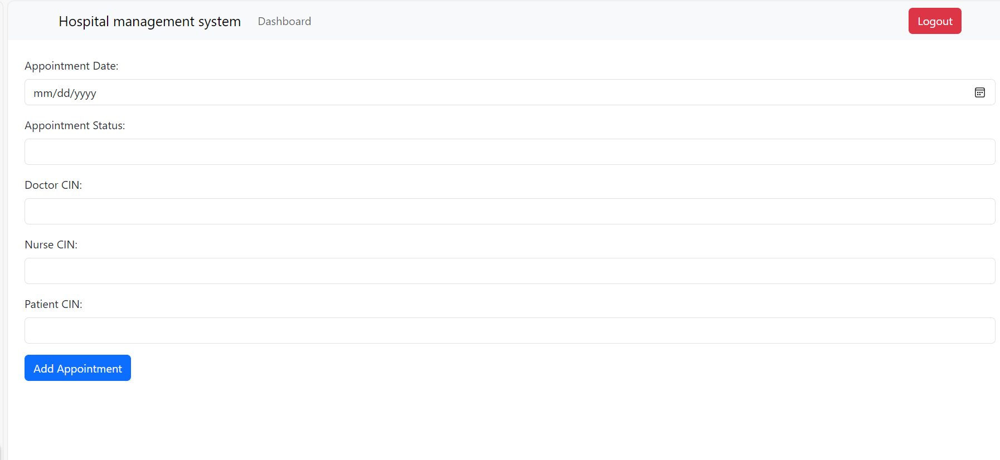

