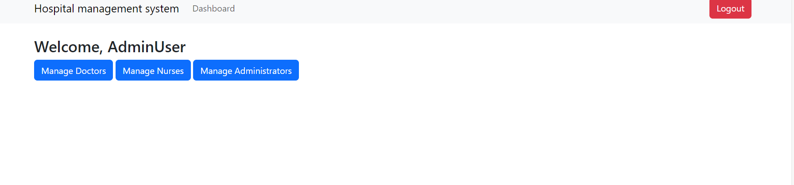
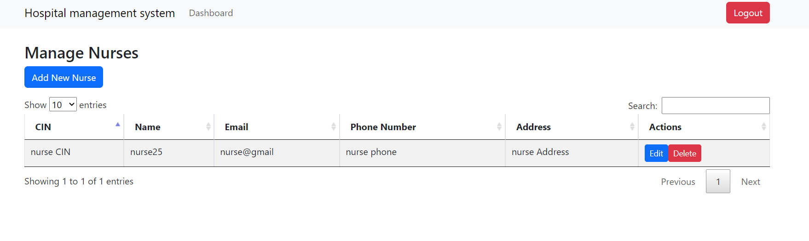
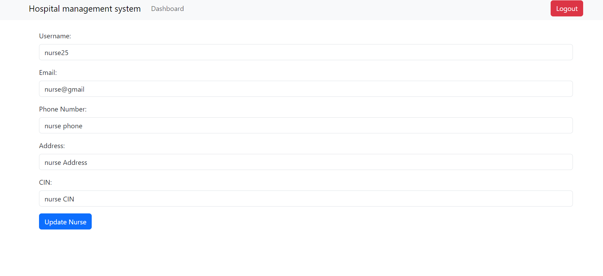

# Hospital Patient Archive Management Platform

The Hospital Patient Archive Management Platform is a comprehensive digital system designed to streamline the management of patient records and archives within a healthcare facility. This platform provides an efficient way to handle patient information, enhancing the workflow within medical institutions.
## Getting Started 
### Prerequisites: 

Before you begin, ensure you have the following installed on your system:

WAMP Server: This package contains Apache, MySQL, and PHP, essential for running the platform locally.
### Configuration

### Database Setup
The platform uses a MySQL database. The connection details are set in the PHP class Db (db/db.php). You will need to adjust these settings according to your local environment.

### Modify Connection Details:
In the Db class (db/db.php) , you will find variables for host, username, password, and database name. Adjust these to match your local MySQL setup.

## Usage  
### Dashboard  
Upon opening the platform, you will be greeted with the login screen.

### Doctor's Dashboard  

If you log in as a doctor, you will see the following dashboard.

 ### View Patient Management Record  
To view patient management records:

Here you can select the number of entries to display.

### Search for a Patient 

You can search for a patient using their first and last name.

Alternatively, a simple name search is also available.

 ### Update a Patient's Information  
To update a patient's information, follow these steps:

### View Patient Information 
You can also view detailed patient information.

### View Medical Record Detail 
To view a patient's medical record details:

### Appointments Per Day 
Go back to the dashboard to view appointments scheduled for the day.

 ### Logout 
You can log out of the system as needed.

### Nurse's Dashboard 
If you log in as a nurse, you will see a similar dashboard.

### Patient List 
Nurses can access the complete list of patients.

The search and update functionalities for nurses are similar to those in the doctor's dashboard.
### Adding a New Patient 
Nurses can add new patients to the system.

### Nurse's Appointments 
From the nurse's dashboard, you can view and manage appointments.

### Adding a New Appointment 
Nurses can schedule new appointments.

### Admin's Dashboard 

###   Manage doctors
Admin can Manage doctors

Admin can Add a new doctor

Admin can Edit a doctor

Admin can delete a doctor

###   Manage nurses
Admin can Manage nurses

Admin can Add a new nurse

Admin can Edit a nurse

Admin can delete a nurse

###   Manage admins
Admin can Manage admins

Admin can add admins

Admin can Edit admins

Admin can delete an admin 

