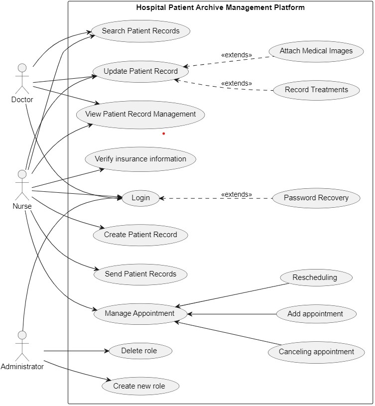

# Hospital Patient Archive Management Platform Use Case Diagram

## Actors:
- **Doctor:** 
- **Nurse:** 
- **Administrator:**

## Use Cases:
- **View Patient Record Management:** Both doctors and nurses can view patient records.
- **Search Patient Records:** Doctors and nurses can search for patient records.
- **Create Patient Record:** Nurses create new patient records.
- **Update Patient Record:** Both doctors and nurses can update patient records.
- **Attach Medical Images and Record Treatments:** Extensions of updating patient records for attaching images and recording treatments.
- **Send Patient Records:** Nurses can send patient records.
- **Create new role and Delete role:** Administrator can create and delete roles.
- **Manage Appointment:** Overall category for appointment-related use cases.
- **Rescheduling , Adding and Canceling appointment:** Sub-use cases of managing appointments.
- **Verify insurance information:** Nurses verify patient insurance information.
- **Generate Reports:** Administrators generate reports.
- **Login and Authentication:** All actors (Doctor, Nurse, Administrator) must go through authentication, which includes the use case "Login." Password recovery is an extension of the authentication process in case they forgot their password.

## Interactions:
- **Nurse interactions:** Nurses are involved in creating , updating and viewing patient records, managing appointments, and verifying insurance.
- **Doctor interactions:** Doctors can search, update, and view patient records.
- **Administrator interactions:** Administrators manage roles, create/delete roles, and generate reports.

